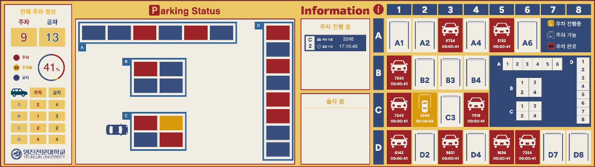

# [parking-control-system]()

このプロジェクトの README は日本語と韓国語で提供いたします。
 
이 프로젝트의 README는 한국어와 일본어로 제공됩니다.

- [日本語 (Japanese)](README.md)
- [한국어 (Korean)](README_ko.md)

  

# 目次

[1. プロジェクト紹介](#プロジェクト紹介)

[2. プロジェクトメンバー](#프로젝트-멤버)

[3. 基本機能](#基本機能)

[4. 技術スタック](#技術スタック)

[5. 実績](#実績)

[6. リポジトリ](#リポジトリ)

  

# プロジェクト紹介

**Parking Control System**は **屋外大型駐車場**にて **カメラ**を利用して車両を効率的に管理し、混雑を減らして利用者に最適な駐車体験を提供するシステムです。

### 従来のシステムとの比較

| 項目         | 埋設型センサーシステム                                   | カメラベースのシステム                                                     |
| ------------ | -------------------------------------------------------- | -------------------------------------------------------------------------- |
| 設置         | 各駐車スペースごとに複雑な設置が必要                     | 比較的設置が簡単で、複数のスペースを同時に管理可能                         |
| コスト       | 初期設置コストが高く、駐車スペースが増えるとコストも増加 | 複数のスペースをカバーできるため、駐車スペース拡張による追加コストが少ない |
| メンテナンス | メンテナンスが難しく、コストが高い                       | ソフトウェアのアップデートで簡単にメンテナンス可能                         |
| 機能性       | 車両の有無のみ検知可能                                   | 経路案内など高度な機能を提供可能                                           |
| 拡張性       | 駐車スペースごとに追加のセンサー設置が必要               | カメラで複数のスペースをカバーできるため、拡張性に優れる                   |

### 目標

このシステムは **カメラを基盤とした技術**を通じて **リアルタイム車両位置検知**, **ナンバープレート認識**, **経路の最適化** などの機能を提供して、駐車スペースが増えるほど、経済性と効率性を最大化し、よりスマートな駐車管理環境を構築することを目指しています。

### 📽️ **紹介動画（YouTube）**

  

# プロジェクトメンバー

|                     [ 金 圭珉(キム ギュミン)](https://github.com/kyumin1227)                      |                                         [金 敏錫(キム ミンソク)](https://github.com/kms8032)                                         |                                         [金 聖埴(キム ソンシク)](https://github.com/Gapsick)                                         |                                        [大井 彩夢(おおい あやめ)](https://github.com/ohiayame)                                        |                                         [河井 皐(かわい さつき)](https://github.com/Saaatsuki)                                         |
| :------------------------------------------------------------------------------------------------------------------------------------: | :----------------------------------------------------------------------------------------------------------------------------------: | :----------------------------------------------------------------------------------------------------------------------------------: | :-----------------------------------------------------------------------------------------------------------------------------------: | :------------------------------------------------------------------------------------------------------------------------------------: |
|  |  |  |  |  |

 

| 名前                                                                               | 担当                                                                                         |
| ---------------------------------------------------------------------------------- | -------------------------------------------------------------------------------------------- |
| **金 圭珉(キム ギュミン) ＜チームリーダー＞** | プロジェクト管理、メインプログラム開発、モニターページおよび Socket サーバー開発             |
| **金 敏錫(キム ミンソク)**                                                         | 3D プリンターを使用した駐車場モデル作成、ドットマトリックスおよび Arduino の配線とコード作成 |
| **金 聖埴(キム ソンシク)**                                                         | Jetson Nano と Orin Nano 間の UART 通信構築、環境設定、出入り口モーター制御                  |
| **大井 彩夢(おおい あやめ)**                                                       | OCR を使用したナンバープレート認識モデルのデータセット収集と学習                             |
| **河井 皐(かわい さつき)**                                                         | モニターページの企画とデザイン、プロジェクト文書整理および発表資料（PPT）作成                |
| **共同作業**                                                                       | 車両認識モデル学習のためのデータセット収集およびラベル付け                                   |

  

# 基本機能

### ナンバープレート認識

YOLO を使用してナンバープレートを検出し、その後 EasyOCR を使って文字を読み取ります。

### 車両追跡

YOLO を使用して認識した車両オブジェクトを、DeepSORT を使って追跡します。

### 経路案内

追跡した車両の位置を基に、区域の混雑度を計算して経路を案内します。

### モニターページ

カメラで計算した情報を基に、情報を表示します。

  

# 技術スタック

### ハードウェア

- **Jetson Nano**: ナンバープレート認識および入出庫プログラムの実行
- **Orin Nano**: オブジェクト検出、追跡およびメインプログラムの実行
- **Arduino**: 駐車場内のドットマトリックス制御
- **サーボモーター**: バリアゲート制御
- **3D プリンター**: 駐車場モデルの作成
- **ドットマトリックス**: 駐車スペースの方向案内表示

### ソフトウェアおよびライブラリ

- **YOLO (You Only Look Once)**: 車両およびナンバープレート検出モデル
- **OpenCV**: 画像処理および車両位置追跡
- **EasyOCR (Optical Character Recognition)**: ナンバープレートの文字認識
- **DeepSORT**: 車両トラッキング
- **Flask**: サーバー構築およびクライアントデータ通信
- **Socket.IO**: リアルタイム通信によるモニターページの更新
- **React**: モニターページのフロントエンド開発

### プログラミング言語

- **Python**: メインプログラムおよびサーバー、入出庫機の開発
- **TypeScript**: モニターページ開発
- **C**: Arduino 通信および制御

### 通信プロトコル

- **UART**: Jetson Nano と Orin Nano、Orin Nano と Arduino 間の通信
- **Socket.IO**: プログラム、サーバー、クライアント間のリアルタイムデータ送信

  

# 実績

### 展示（2024 産学研協力 EXPO、韓国教育部主催）

    
    

### 受賞

<table>
  <tr>
    <td align="center" style="width: 260px; word-break: break-word;">
       
      キャップストーンコンテスト（校外） 
      <strong>奨励賞</strong>
    </td>
    <td align="center" style="width: 260px; word-break: break-word;">
       
      キャップストーンコンテスト（校内） 
      <strong>大賞</strong>
    </td>
  </tr>
</table>

# リポジトリ

- [Hardware](https://github.com/Parking-control-system/Parking-control-system-Python-Hardware) - メインプログラム、入出庫機、Arduino 制御
- [Frontend](https://github.com/Parking-control-system/Parking-control-system-Frontend) - モニターページ
